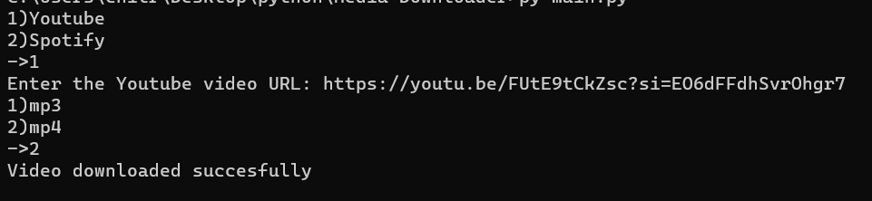

# YT-Spotify-dl

A CLI agent for downloading video or audio files from Youtube or Spotify using the link.

## Getting Started
### Prerequisities
1. Python-3.6 or above
2. pytube
3. os
4. time
5. re
6. youtubesearchpython
7. VideoSearch
8. Youtube

### Installing
Clone or download it from github and install all the requirements. You can install them easily by this command `pip3 install requirements.txt` or install one by one.

### Setting up the output file
1. Right click and open file `main.py` in your desired text editor, at line 21 and line 22 put your desired output directory between the `" "`.
2. Save the file.

### Screenshots

## License
This project is licensed under the [MIT License](LICENSE).

